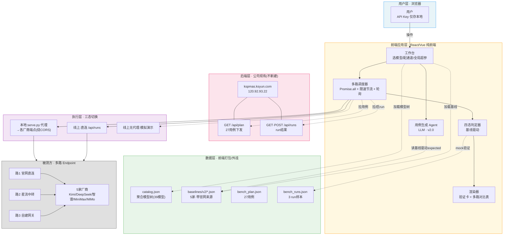
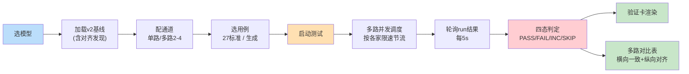
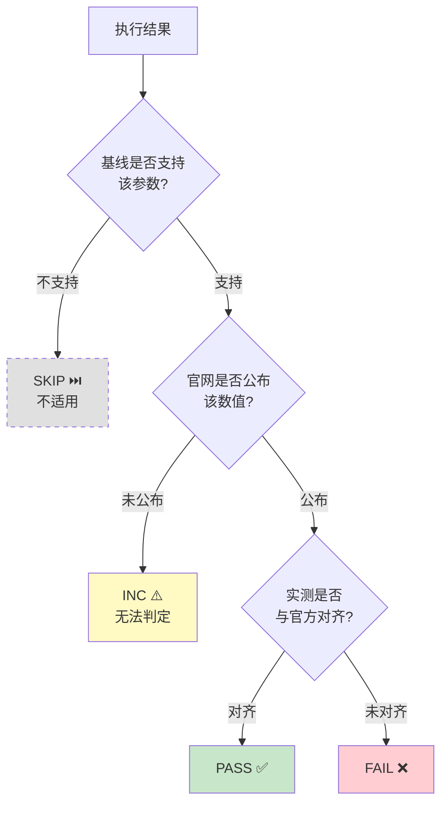
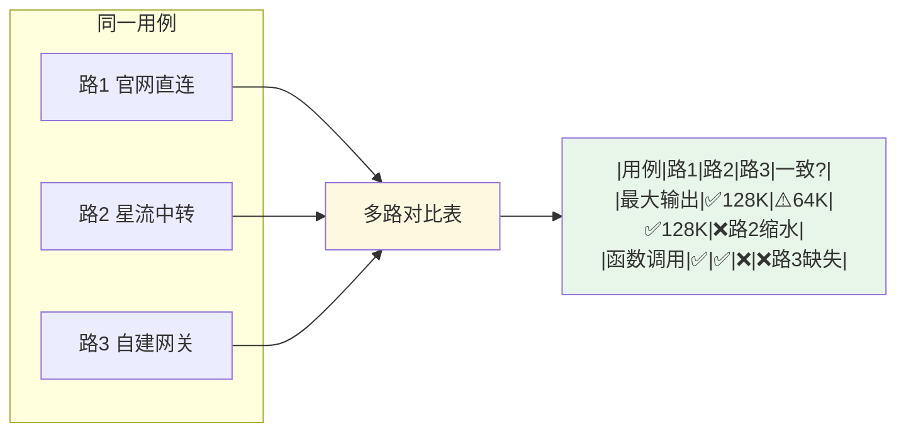
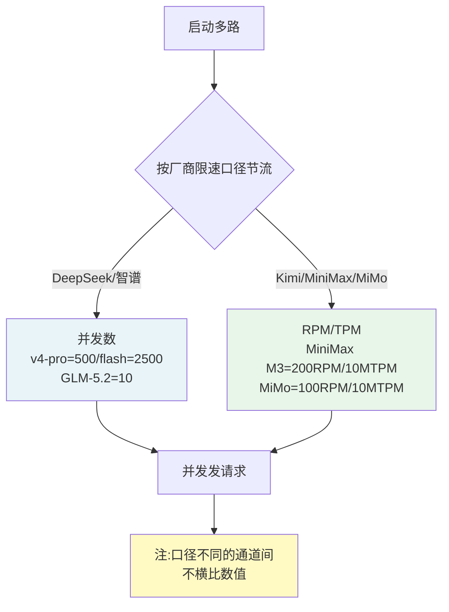

# 星流 LLM 多路 Endpoint 验收对比工具 · 逻辑架构图

> 生成日期：2026-08-31
> 图格式：Mermaid（VSCode/GitHub 预览可渲染）+ SVG（浏览器直接打开）
> 配套文件：`architecture.svg`（同目录，位图替代）

---

## 一、整体分层架构

---

## 二、工作流（数据流时序）

---

## 三、四态判定逻辑

---

## 四、多路对比示意

---

## 五、限速口径（前端节流依据）

